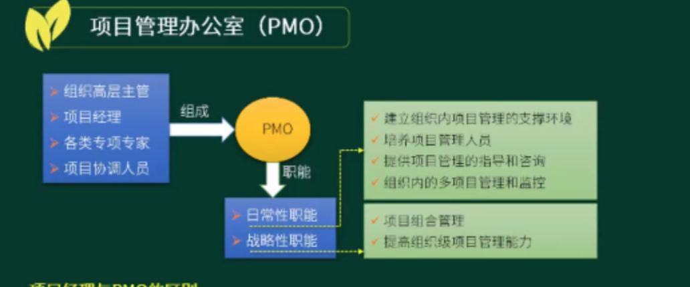
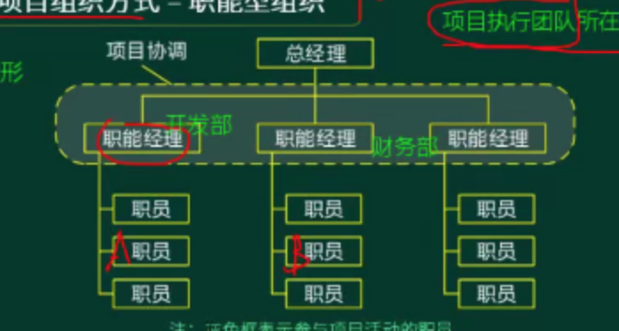
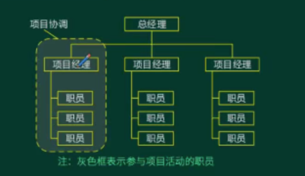
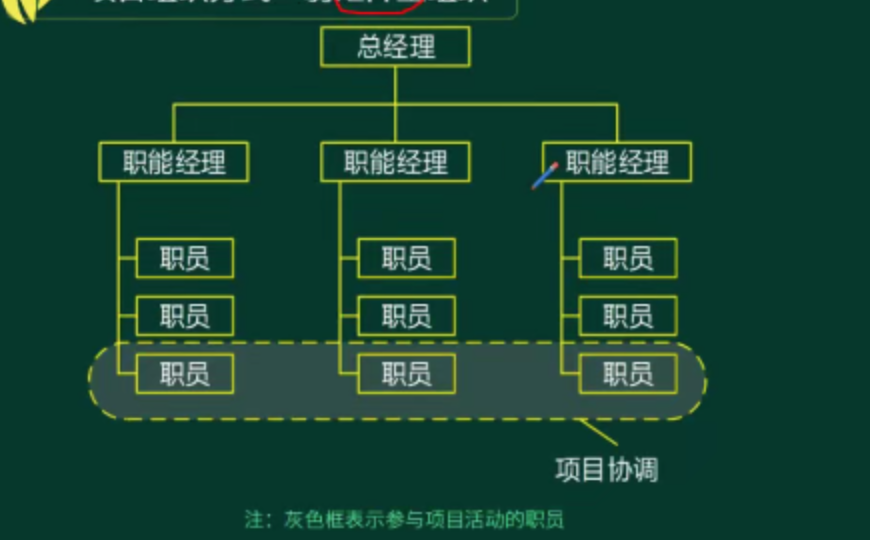
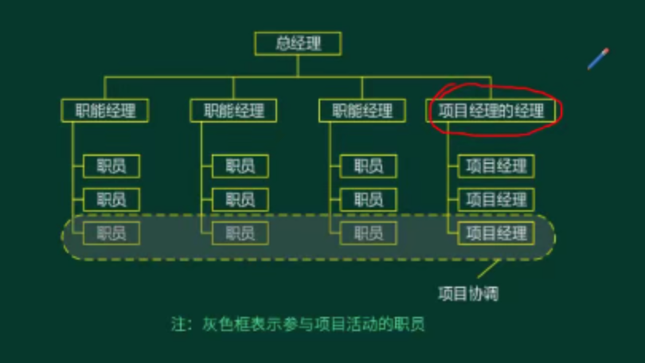

- #### 项目
	- 概念：项目是什么？什么是项目？ #card
		- 项目是为达到特定目的、使用一定资源、在确定的时间内、为特定的发起人所提供的特定产品、服务或成果而进行的一次性任务。
	- 特点：项目有哪个三个特点？ #card
	  card-last-interval:: -1
	  card-repeats:: 1
	  card-ease-factor:: 2.5
	  card-next-schedule:: 2022-08-23T16:00:00.000Z
	  card-last-reviewed:: 2022-08-23T07:43:07.662Z
	  card-last-score:: 1
		- 1. 临时性 (一次性)
		  2. 独特性 (独特的产品、服务或成果)
		  3. 逐步完善性 (渐进明细性)
	- 目标：项目的2目标1原则是什么? #card
		- 成果性目标：
			- 通过项目开发出的满足客户要求的产品、服务或成果。
		- 约束性目标：
			- 指完成成果性目标所需要的时间、成本以及满足的质量、范围等。
		- SMART原则：关于项目目标的特点有哪些？ #card
			- Specific - 具体的
			- Measurable - 可测量的
			- Attainable - 可达成的
			- Relevant - 与战略目标相关联的
			- Time Bound - 有一定时限的
- #### 信息系统(集成)项目
	- 特点：信息系统项目的特点有哪些？，信息集成系统都有哪些特点? #card
		- 1. 目标不明确， 需求变换频繁
		  2. 智力密集型
		  3. 涉及队伍庞大，涉及人员高度专业化
		  4. 涉及的承包商多
		  5. 需要研制开发大量的软硬件系统
		  6. 项目生命周期通常较短
		  7. 通常涉及大量的新技术
		  8. 使用和维护的要求非常复杂
- #### 项目与日常运营、组织战略关系
	- 项目与日常运营统称为工作，每个组织都通过从事某些工作来实现战略目标。项目通常是实现组织战略计划的一种有效手段。
	- #### 项目与日常运营
		- 相同点：
			- 1. 由人来做
			  2. 受限于有限资源
			  3. 需要计划、执行和控制
		- 根本区别：
			- 1. 项目的目标是达到响应的目标，从而结束目标
			  2. 日常得目标是为了维持业务的经营
			  3. 两者在产品声明周期的不同时间点交叉，每个交叉点，可交付成果及支持在项目与运行之间转移，以完成工作交接。
- #### PMO
	- {:height 200, :width 414}
	- 与项目经理的区别：PMO和项目经理有什么不一样? #card
		- 项目经理关注特定的项目目标，PMO的工作目标包含组织级观点
		- 项目经理控制资源以实现项目目标，PMO对所有项目的共享资源进行优化使用。
		- 项目经理管理单个项目的制约因素，如进度、成本与质量等，PMO从企业层面管理风险，机会等。
		-
- #### 生命周期
	- 项目生命周期并没有唯一的划分方式，单它通常要规定
		- 1. 每个阶段要完成哪些技术工作
		  2. 每个阶段的交付物，何时及如何产生。
		  3. 每个阶段都有哪些参与人员
		  4. 如何控制和批准每个阶段
	- 项目生命周期是产品生命周期的一部分。
	- 项目周期一般划分：
		- 1. 概念阶段
		  2. 规划阶段
		  3. 实施阶段
		  4. 收尾阶段
- `事业环境因素`：判断标准? #cards
	- 项目经理不可以改变的，对项目执行有限制约束的事情
- `组织过程资产`：什么是组织过程资产？ #cards #基础概念
	- 项目经理可以改变的，对项目执行有帮助的，可以参考的事情。
- #### 项目组织方式
	- 概念：项目执行团队所在组织的组织结构
	- 分类：项目组织有哪几种分类，什么图形？什么优缺点？ #cards
		- `职能型组织`-传统性组织方式
			- 结构图： {:height 211, :width 283}
			- 优点：
				- 1. 强大的技术支持，便于知识、技能和经验沟通
				  2. 清晰的职业晋升路线
				  3. 直线沟通，简单。责任和权限很清晰
				  4. 有利于重复性工作为主的过程管理
			- 缺点：
				- 1. 职能利益优先于项目，具有狭隘性
				  2. 组织横向连接薄弱，部门间协调难度大
				  3. 项目经理极少或缺少权利和权威
				  4. 项目管理发展不明，缺少项目基准
		- `项目型组织`
			- 结构图：
				- {:height 262, :width 301}
			- 优点：
				- 1. 结构单一，权责分明，利于统一指挥
				  2. 沟通简介、方便
				  3. 决策快
			- 缺点：
				- 1. 管理成本过高，如：项目工作量不足则资源配置效率低
				  2. 项目环境封闭，不利于沟通，技术知识等共享
				  3. 员工缺乏事业上的连续性和保障
		- `矩阵型组织`
			- 弱矩阵型组织->没有项目经理，组员直接沟通，项目协调员进行协调
				- {:height 194, :width 331}
			- 强矩阵型组织->全职的项目经理，单独的PMO管理部
				- {:height 177, :width 356}
			- 平衡矩阵型组织->组员担任全职的项目经理，没有单独的PMO管理部
				-
-